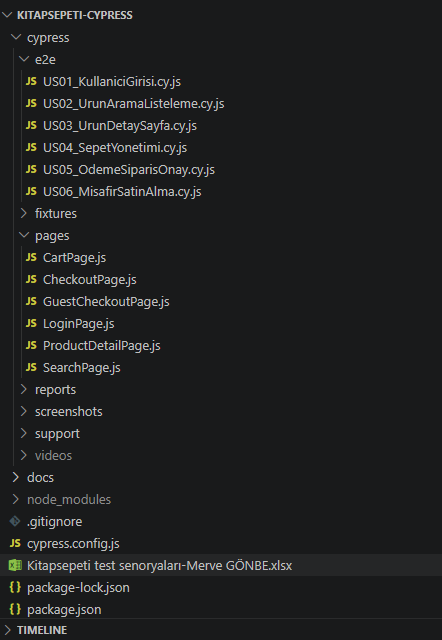

# 🧪 Kitapsepeti.com – Cypress E2E Test Otomasyonu

## 📌 Proje Hakkında
Bu proje, Kitapsepeti.com e-ticaret platformunun giriş, sepet ve ödeme süreçlerini test etmek amacıyla hazırlanmış POM mimarisine sahip uçtan uca (E2E) test otomasyon projesidir.  
Amaç, kullanıcının alışveriş deneyimini sorunsuz ve güvenli şekilde tamamlayabildiğini doğrulamaktır.

---

## 🧪 Test Edilen User Story'ler

| User Story | Açıklama |
|-----------|---------|
| US01 | Kullanıcı Girişi |
| US02 | Ürün Arama ve Listeleme |
| US03 | Ürün Detay ve Sepete Ekleme |
| US04 | Sepet Yönetimi |
| US05 | Ödeme ve Sipariş Onayı |
| US06 | Misafir Olarak Satın Alma |

---

## 🛠️ Kullanılan Teknolojiler
- JavaScript  
- Cypress  
- Page Object Model (POM)
- Mochawesome
- Node.js & npm

---

## 📁 Proje Yapısı

kitapsepeti-cypress/
│
├── cypress/
│   ├── e2e/            # Test senaryoları
│   ├── pages/          # Page Object Model dosyaları
│   ├── fixtures/       # Test verileri
│   ├── reports/        # HTML test raporları
│   ├── screenshots/    # Hata ekran görüntüleri
│   ├── videos/         # Test video kayıtları
│   └── support/        # Custom komutlar
│
├── cypress.config.js
├── package.json
└── README.md

---

## ⚙️ Kurulum

npm install

---

## 🚀 Testleri Çalıştırma

Headless mod

npx cypress run

Arayüz ile

npx cypress open

---

## 📊 Test Raporları ve Kanıtlar

🔗 **Canlı Test Raporu (Mochawesome):**  
👉 [🚀 Test Raporunu Görüntüle](https://mervekimyagonbe.github.io/kitapsepeti-automation/)

📁 **Test Videoları:**  
👉 [🎥 Videoları İzle](https://drive.google.com/drive/folders/1yu1JQhejhsCZ2pISsUescM3_2Gi0bQUh?usp=drive_link)

📄 **Manuel Test Senaryoları:**  
👉 [📑 Test Senaryolarını Görüntüle](https://docs.google.com/spreadsheets/d/1uee_BsurqkPWSUblX28IQ2FfNphz8iCB52aOHEOX1gc/edit?usp=sharing)

---
## 📁 Proje Yapısı

## 👩‍💻 Geliştirici

**Merve Gönbe**  

